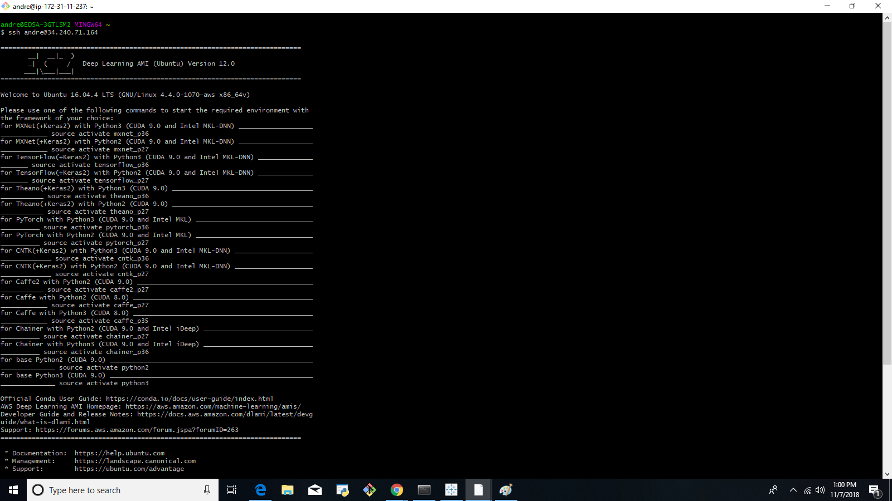
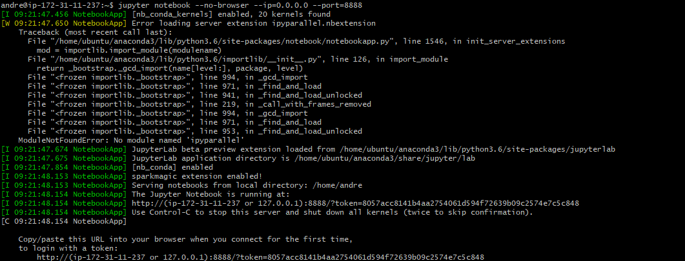

# jupyter_notebook_on_aws_ec2
How to run a Jupyter notebook on AWS

In this document I detail the process I followed to run a Jupyter Notebook, task on an AWS EC2 instance.  Not all steps are described in detail, it will be done in due time.

  - Navigate to [AWS login page](https://aws.amazon.com/)

 
 - Click on Sign In to the Console

Create and/or Launch your instance [AWS EC2 Management Console](https://docs.aws.amazon.com/efs/latest/ug/gs-step-one-create-ec2-resources.html)

  - Copy the IPv4 Public IP
    e.g. 34.240.71.164
  - Access your instance via Git Bash
    - Open a Git bash shell and type the following commands
         - $ ssh andre@34.240.71.164

Follow any further instructions e.g. entering your password, etc.

You should see the following output:

  - To write code on your local pc using a Jupyter notebook that is hosted on an AWS EC2 instance, you need to do the following in the Git shell:
    - jupyter notebook --no-browser --ip=0.0.0.0 --port=8888

If successful, you should see the following output:

Copy the URL
  - http://(ip-172-31-11-237 or 127.0.0.1):8888/?token=78a2ccce937d2ec296e432d50dffc14d9ff9baed29d0ec03

Modify this URL by replacing this:
  - (ip-172-31-11-237 or 127.0.0.1) with this:
  - 34.240.71.164 

Your URL should look as follows:
  - http://34.240.71.164 :8888/?token=8057acc8141b4aa2754061d594f72639b09c2574e7c5c848

Paste the URL in the web browser of your choice, if successful, you should see the following:

**MANAGING FILES** 

Open another Git Bash shell to manage files between your local pc and your remote instance.

To copy your script to your remote instance run the following commands:

Navigating to the local (on your pc) directory:
  - $ cd Downloads/NLP/

Copy file from local pc to remote instance
  - $ scp ./NLP.ipynb andre@34.240.71.164:/home/andre/NLP.ipynb

If successful, you should see the following:
  - NLP.ipynb                                     100%   24KB  61.6KB/s   00:00

To copy your script from the remote instance back to your local pc after making changes:

Open a new Git Bash shell/terminal and run the following commands in Git Bash:
  - $ scp andre@34.240.71.164:/home/andre/NLP.ipynb ./Downloads

If successful, you should see the following:
  - NLP.ipynb                                     100%   24KB  61.6KB/s   00:00
  
Congratulations, you have done it!
